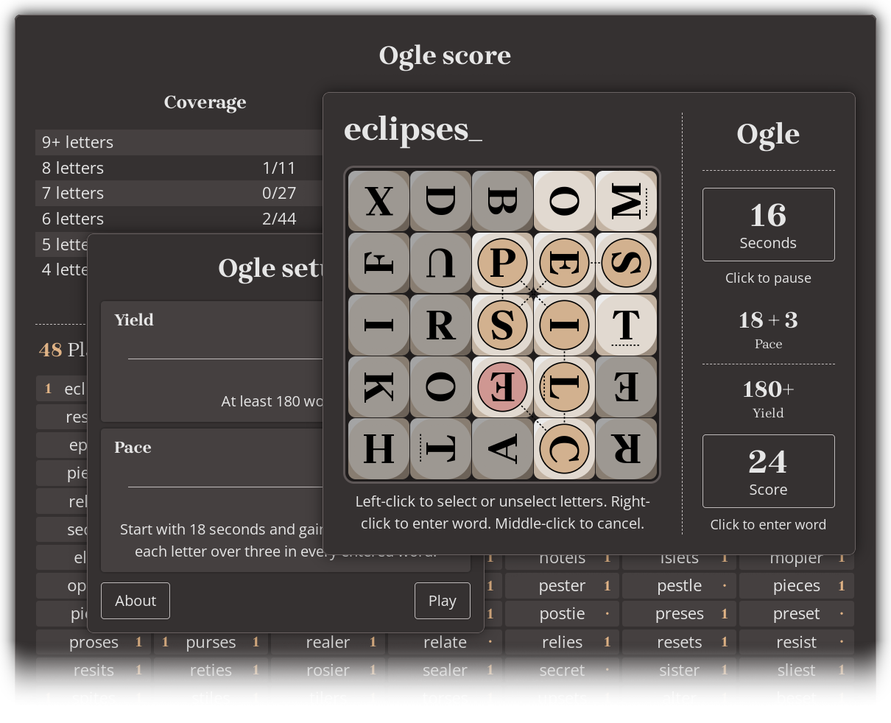

# Ogle: Word-finding game for the web

Ogle is a free word-finding game for the web and mobile. It derives from a tabletop game you’ve probably played, but the pace is much faster. [_Play it now_.](https://www.anthemion.org/play-ogle/)



I created the [first version](https://github.com/anthemion-org/ogle) of this app years back, when I was learning C#. I created this version when I was learning React.

Ogle is a progressive web app, so you can install it on your phone much like any other app. If you navigate to the [play address](https://www.anthemion.org/play-ogle/), your phone should offer to install it. Your phone’s browser will also display _Install app_ (or similar) in its page menu.

If you find a bug, write to [support@anthemion.org](mailto://support@anthemion.org).


## License

Ogle has copyright ©2006-2023 Jeremy Kelly. You can view the source code here or copy it to your device, but — for now, at least — _you may not reuse or redistribute it_. I may open-source it some day.

The Ogle word lists derive from [SCOWL](https://wordlist.sourceforge.net/), copyright ©2000-2004 Kevin Atkinson. Use and distribution of SCOWL are subject to the terms of the [SCOWL License](Misc/scowl_license.txt).


## Project structure

The project was created with _create-react-app_.

The `src` folder includes these subfolders:

- `Board` contains types representing game boards and individual letter dice, plus board-generating code;

- `Round` contains types that represent a ‘round’ of play;

- `Search` contains types that represent the Ogle and user lexicons, plus word search functionality;

- `Store` contains the Redux store and slices;

- `UI` contains page-level React components;

- `Util` contains general-purpose types and utilities.

In this project, **views** are top-level components that represent pages. Most views correspond to `StsApp` values. **Dialogs** are smaller pages that are superimposed over views. Some people call these ‘modals’, even though they aren’t always modal. **Looks** are components that display complex data within a view or dialog. Some examples are `LookDie` (which renders a single letter die) and `LookBoard` (which renders the entire board).


## Architecture

#### State management and persistence

Ogle uses Redux Toolkit to manage much of its state. Most of that data is persistent, so I used the store’s `subscribe` method to write state data to the browser’s local storage after each update. This produces two criteria for adding data to the store, both of which should be met:

1. The data must be used when rendering pages;

2. The data must be read or written by multiple components, _or_ it must require persistence.

Persistent data that are _not_ used for rendering should be persisted directly with the `Persist` module. Render data that is _not_ shared or persisted should be managed with `useState` or `setState`.

The `Persist` module serializes data as JSON, which stupidly fails to accommodate `NaN` or `Infinity` values, so `Persist` uses the `UtilJSON.uNumFix` function to convert these to strings automatically. Every persistable type provides a `uFromParse` function that converts these JSON-damaged objects back to their correct forms.


### PWA functionality

For the convenience of mobile users, Ogle is a progressive web app (PWA). I did not use the `cra-template-pwa` option when I ran `create-react-app`; I used the default template, and later added `service-worker.js` and `serviceWorkerRegistration.js`, as copied from the [cra-template/pwa](https://github.com/cra-template/pwa/tree/main/packages/cra-template-pwa/template/src) repository. Then I added a `register` call to `index.js`. Instructions can be found [here](https://dev.to/myfatemi04/turn-your-create-react-app-into-a-progressive-web-app-in-100-seconds-3c11).

The PWA works fairly well on Android, but it cannot reasonably be said that the experience matches that of a native app. The ‘install’ process seems awkward, and there is a bug in the Android version of Chrome that sometimes causes the Play view to grow larger than the viewport, so that unwanted scrolling occurs.


### Class and function components

Aside from `ViewSets` (and the error boundary) all components are implemented as functions, and most use hooks. That works well for simple components, but class components might have been better. `useEffect` is ugly, and it pulls all sorts of non-rendering functionality into what was just a render function. Handlers (if they do almost anything relevant) also must be defined there. `useCallback` adds another layer of nesting and indentation to this now massive function.

Bigger problems are produced by `useSelector` and `useDispatch`. These hooks — though convenient — couple the render code to specific selectors and actions, producing components that are _inherently less flexible_ than those wrapped by Redux’s (admittedly confusing) `connect` function. It’s easy to say that those are just bad hooks, and you can still use `connect` with your function components. However, if we eliminate the convenience of `useSelector` and `useDispatch`, there isn’t as much reason to prefer functions over classes.


## Programming conventions

### Identifier naming

The Ogle source code uses a new identifier naming convention I am developing. This convention was inspired by the [Split notation](https://www.anthemion.org/split_notation.html) I use with C# and C++, but JavaScript differs so much from those languages, it seems impossible to make the notations compatible.


#### Identifier prefixes

Every identifier begins with zero or more prefixes, in the following order, with at most one prefix from each table:

| Prefix | Meaning                                 |
|:------:|-----------------------------------------|
| `_`    | ‘Private’ variable or function          |

| Prefix | Meaning                                 |
|:------:|-----------------------------------------|
| `a`    | Function parameter                      |
| `o`    | Local variable or function              |

| Prefix | Meaning                                 |
|:------:|-----------------------------------------|
| `t`    | Class                                   |
| `u`    | Function                                |

| Prefix | Meaning                                 |
|:------:|-----------------------------------------|
| `i`    | Generator/iterator function or object   |
| `j`    | Index variable                          |
| `n`    | Property name variable                  |

| Prefix | Meaning                                 |
|:------:|-----------------------------------------|
| `w`    | Asynchronous function or promise object |

| Prefix | Meaning                                 |
|:------:|-----------------------------------------|
| `z`    | Special (see below)                     |

Most prefixes identify a scope or a ‘mode of address’ — a distinct way of referencing some data. Other prefixes mark technical details that require special attention. The `z` prefix has no set meaning; it can be used to resolve name collisions with third-party code, or for any other reason.

Using these prefixes, a class defining a ‘private’ function (really one we would _like_ to be private) that accepts an `async` function parameter might begin with:

```
class tBuff {
  _uFromRead(auwRead) {
    ...
```


#### Identifier roots

After the prefixes, most identifiers include a Pascal-cased string that describes the business concern or other high-level concept that is being referenced. This is called the _root_. Because each identifier’s scope and mode of address is documented in the prefixes, the same root can be reused — without name collisions — as the concept is referenced in different ways. Imagine a function that reads account data associated with a numeric index, logs the account retrieval, and then returns the data:

```
export function uAcct(ajAcct) {
  const oAcct = Accts[ajAcct];
  uLog_AccessAcct(oAcct);
  return oAcct;
}
```

The function `uAcct`, the array index `ajAcct`, and the returned object `oAcct` all reference the same entity in different ways, yet the names do not conflict. In fact, their commonality is _emphasized_, rather than hidden, making it easier to spot conceptual mismatches.

To maintain that emphasis, the noun or verb that defines the concept most basically is listed _first_ within the root, making it easier to see what a given identifier represents. Modifiers follow in _decreasing order of importance_. This ensures that the most important words remain visible. In the following example, the fact that we accidentally copied a credit card number (rather than the hash of that number) should draw immediate attention:

```
const oHashNumCardDef = aNumCardUser;
```

When we name things the way most developers do, the problem is hidden:

```
const oDefCardNumHash = aUserCardNum;
```

It is sometimes acceptable to omit the root, producing an identifier of prefixes only, as in the loop index below:

```
for (let oj = 0; oj < aEls.length; ++oj) {
  ...
```

This should be reserved for short functions, where the context is simple and obvious.


##### Function roots

Functions are often named with a verb. If that verb acts on a direct object, the verb and its modifiers are listed _first_, these are followed by an underscore, then the verb’s _object_ is given, along with its modifiers. This clarifies which modifiers apply to the verb, and which to the object. As an example, a function that performs a ‘full update’ on the ‘read cache’ might be named:

```
function uUpdFull_CacheRead() {
  ...
```

These ‘verb’ functions usually produce side effects.

Other times, functions are named only with nouns. When this is done, the noun is _what the function returns_. These ‘noun’ functions usually do _not_ produce side effects, though they can. When the result is assigned to a variable, that variable generally has a similar root, making it easier to spot crossed wires:

```
const oBuff = aStm.uBuff();
```

Roots representing boolean values typically begin with `Ck`. This provides a consistent replacement for the `is` and `has` prefixes that some developers use for boolean identifiers.

When a function returns a boolean, the `Ck` root honors the rule that noun names tell the reader _what_ is being returned — specifically, a ‘check’ of some sort. This avoids many ambiguities. Consider a method named `uReady`. Does this method tell us _whether_ the instance is ready, or does it cause the instance to _become_ ready? In this case, if the method were answering a ‘yes/no’ question, it would be called `uCkReady`, so the verb usage must be intended. Distinguishing ‘noun’ functions from ‘verb’ functions makes both names more meaningful, and it allows `uReady` and `uCkReady` to be defined in the same instance without colliding.

English being what it is, ambiguities can yet arise. For instance, is ‘Cache’ a noun or a verb? When read as a noun, `uCache` perhaps returns a caching object. When read as a verb, the same function caches some unspecified value. It might help to suffix standalone verbs with an underscore (continuing the ‘verb/underscore/object’ pattern described earlier) but I have never tried that. Most ambiguities are solved by the verb/noun distinction, but this is something to watch for, and sometimes I chose different names to avoid it.

Factory functions often have roots that begin with ‘From’; the noun is implicit, as these functions are meant to be invoked after specifying the containing class or module:

```
import * as Board from "./Board.js";

function uExec(aParseBoard) {
  const oBoard = Board.uFromParse(aParseBoard);
  ...
```


#### Abbreviations and containers

Long names produce long expressions that are hard to read, especially when their length causes the line to wrap, so longer words are abbreviated within identifiers, file and folder names, _et cetera_. Some developers, after being confounded by a few poorly-chosen abbreviations, forswear identifier abbreviation altogether. I sympathize, truly, but every team and every industry abbreviates things, so the question is not _whether_ to abbreviate, it is _when_ and _how_ to abbreviate. The obvious answer: terms that are longer, or used more often, are more deserving of abbreviation. Note that the more you use a given term, the more you gain by abbreviating it, and the safer it is to abbreviate, as the repetition makes it easier to remember. My projects frequently use the word ‘Position’, so I abbreviate aggressively to produce `Pos`. When using a less common word, it is better to choose something longer, or leave it unabbreviated. A word that is abbreviated once must be abbreviated everywhere in the project (outside of comments) and _always the same way_.

Though they might contain the same type of data, a container of values differs fundamentally from a single value. For this reason, containers must be given plural names:

```
let oID = aIDs[0];
```

It is usually unnecessary to indicate the type of the container. However, I name maps (whether instances of the `Map` class, or plain objects used as maps) with a plural noun describing what the map contains, suffixed with ‘By’, and followed with a singular noun that describes the input to the map. The result is something like `CtsByID`, which maps from ‘ID’ keys to ‘count’ values. This places the content at the beginning of the name, like other container names, while reminding the reader how the map is used. It also places the value noun on the side from which the map will be read, and the key noun on the side from which it will be dereferenced:

```
const oCt = oCtsByID[aID];
```

If the name of the variable you’re writing to fails to match the left side, or if the variable you’re using to dereference the map fails to match the right, you’re probably using the map incorrectly.

It is sometimes necessary to pluralize a term that ends with ‘s’. Adding a second ‘s’ could produce something that looks like a different word or abbreviation (consider that `Pos` would become `Poss`) so I add the letter ‘i’, which seems to cause fewer problems:

```
const oPos = aPos[0];
```

That’s a bit awkward, but the pluralization belongs in the root. It might be better to avoid abbreviations that end with ‘s’, or to pluralize these with ‘z’ instead.

It is _never acceptable_ to use or change an abbreviation to avoid a name collision. If names collide:

- You have failed to apply the prefixes correctly (though possibly because you were forced to — see [Notation exceptions](#Notation-exceptions) below); or,

- You have failed to include descriptive modifiers in your roots.


#### Notation exceptions

At times, it is impractical to apply certain prefixes:

- Many developers define parameters or other variables that sometimes reference functions, and sometimes reference non-function values, and there is no way to prefix these correctly. It is usually wrong to use variables this way, because it is impossible to name them accurately, no matter what your notation. I considered a prefix for identifiers that _sometimes_ reference functions, but it doesn’t seem worth it;

- React requires that component names be capitalized, so component classes _cannot_ be prefixed with `t`;

- Some prefixes do not work well with destructuring, particularly `a` and `o`.

When destructuring is used to implement named parameters:

```
function uAdd({ Card, Ent, CkAddFollow, CkSkipAdd }) {
  ...
```

applying the `a` prefix requires that parameters be renamed in the destructuring pattern, which is very noisy:

```
function uAdd({
  Card: aCard, Ent: aEnt, CkAddFollow: aCkAddFollow, CkSkipAdd: aCkSkipAdd
}) {
  ...
```

Note that it would _not_ be correct to apply the prefix within the pattern:

```
function uAdd({ aCard, aEnt, aCkAddFollow, aCkSkipAdd }) {
  ...
```

as the names would look like function parameters (on the caller side) when specified by the caller:

```
uAdd({ aCard: oCard, aEnt: oEnt, aCkAddFollow: true, aCkSkipAdd: true })
```

It is appropriate to omit prefixes in these cases. This _can_ cause names to collide with imports (some of which use no prefix).

Obviously, third-party code also fails to use the prefixes, and that is fine. Working with such code always requires adaptation, to different names and metaphors, different programming styles, _et cetera_. The notation does not exist to give OCD sufferers an outlet for their manic energies; it is meant to make things _better_, not _perfect_.

Having said that, _I’m not convinced that the prefixes work in this language_. They are very helpful in C# and C++, but they disagree to some extent with the flexibility of JavaScript — which after all is the language’s only good quality. I’m still thinking about it.


### Function parameter checks

As something of an experiment, the `Misc` module defines a `uCkThrow_Params` function that is used to check parameter types in many functions. For the most part, I have reserved it for public class methods and API functions. The check is a bit slow, so it is excluded from the critical path within the word search, and from low-level types like Pt2. It is disabled entirely within the production environment.


### Classes, methods, and plain objects

Many JavaScript developers share a bizarre prejudice against classes, and the more I read about their rationale, the more obvious it becomes that they don’t understand classes in the first place. This has unfortunate implications for the entire community.

[todo]
Common misconceptions
	Classes mean inheritance
		For efficient method access, not necessary (though possible) to do more
	Prototypal inheritance is better than classes
		SERIOUSLY?
	Classes mean `new`
		Static factory methods
	Classes mean mutable data
		No more than plain objects
		Subclass must be immutable if parent is
			Liskov substitution

Let’s attempt an objective comparison of classes and plain objects. We’ll also cover methods, while acknowledging that these can be used (awkwardly) with plain objects.

[todo] 'Class' synonymous with prototypal inheritance


#### Class advantages

First, _type information is useful_. Whether you use TypeScript or not, type checks are a good way to verify the correctness of your program, and — even without compile-time checking — they are much easier when your objects contain type data (by way of the `constructor` property). If they check anything at all, most JavaScript developers use a sort of ‘duck type checking’, where they receive an object, look for the members they need, then throw if one is missing. That _is_ more flexible, but it’s also more work, and it produces noisy code.

Type data also provides useful context for the developer. When you see the content of a plain object, do you know what the object represents? Maybe, or maybe the name of the object reference tells you, but it’s not always clear. The class name _tells you what the data represents_.

The class name also makes it easy to find the comments and methods associated with your data, and the places where it may have been instantiated. IDEs like VSCode display some of this information when you mouse over class names, and they can offer code completion when you’re referencing class members. Incidentally, where do you comment the members of your plain object? I know, _JavaScript developers don’t write comments_.

Even _talking_ about these objects is easier when you can summarize them with class names. This is true whether you’re writing comments or discussing with collaborators.

Class declarations neatly package your data, the methods that operate on that data, and the documentation for both.

[todo] Private slots


#### Method advantages

Classes (and more specifically, prototypal inheritance) also provide efficient support for methods. While it _is_ possible to attach methods to any object, it would be wasteful to associate a large API with many plain object instances, as the method properties would be duplicated in every instance.

Methods provide a concise and expressive way to manipulate objects. Let’s make basic use of two APIs, one that works with plain objects:

```
import tArr2 from "Arr2Class.js";

const oArr2 = new tArr2(20, 30);
const oCt = oArr2.Ct();
```

and another implemented with a class:

```
import * as Arr2 from "Arr2Plain.js";

const oArr2 = Arr2.uNew(20, 30);
const oCt = Arr2.Ct(oArr2);
```

When implementing in class, `this` necessary
	Handler binding
`this` not necessary in closure, but method properties duplicated
	Attaching Pt2 API in `uNew` made 'SearchBoard uExec: Speed' run ~7.5% longer
	Most likely construction time, but memory could be relevant
	Okay for most types
	Still not serializable

Method objects never serializable
	Can disable action check in Redux
		Still have to restore methods when reading from selector
			Can't change prototype

Class/object method advantages
	Concise, expressive API invocation
		Reference before dot is 'special' argument
		Dereference defines method location and provides `this` with one identifier
			`this` binding
	Polymorphic
		Procedural function requires module name plus separate argument for `this`
			Couples invocation to module
			Can select different modules by replacing module reference with variable
				Awkward to store this variable in object itself
	Optional chaining invocation (`?.`)
		const oPosi = oArr.uPosEnd()?.uiPosiAdjacent();
			Arr.uPosEnd(oArr)?.uiPosiAdjacent(aPos);

Typescript interfaces provide these advantages, but only with respect to data

Plain object advantages
	Simplicity
	Duck typing
	Explicit API invocation
		Unambiguously locate every invocation
			Import module object consistently
		Converse of 'expressive' invocation
	Serialization
		Redux compatibility
	No `this` binding
		Like telling an amputee that they needn’t trim their fingernails
	Doesn't sequester functionality
		Composition over inheritance
		https://en.wikipedia.org/wiki/Composition_over_inheritance
		Complex hierarchies don't happen that often
			Experience with UI frameworks

Can encapsulate with closures


[todo]
A class like `tPoolDie` could easily be replaced with a factory function that returns a die-generating function. Many JavaScript developers would consider that more idiomatic, but is it better? The class implementation:

- Cleanly separates initialization code from output-generating code;

- Allows object state to be investigated in the debugger without expanding _Variables_ window entries, or visiting the factory function;

- Allows additional methods to be added without restructuring the factory.

The class does expose private data that could have been hidden in a closure, but private variables are marked with underscores in this project, and it’s not hard to remember that they are off-limits. In this case, at least, the class implementation is easier to understand, and easier to maintain.


#### Redux

[todo]
Having said all that, Redux makes it difficult to represent state data with classes.

Some class advantages can be faked, to an extent, with plain objects.
	Record names
	Factory functions
		Member comments here

[todo] Define 'record'
	Identify parameters types in comments
	Always factory functions
		Comment contents there


### Constructors and function overloading

All class variables are initialized and commented in the constructor. If meaningful values are not available, variables are set to `null`.

JavaScript does not allow function overloading in the traditional sense. Some developers emulate overloading by checking parameter values and types at the start of the function, in order to define missing parameters, or call different implementations. That can become surprisingly complex, however.

Overloading is most useful when constructing classes; a rectangle might be constructed from two points, or a point and two lengths, or a JSON string, _et cetera_. In this project, constructors are never overloaded; instead, each constructor accepts all the parameters it is possible to set from outside the class. Static factory functions with descriptive names are then used to invoke that constructor with varying inputs. See `Card.js` for an example; it provides three factory functions, including `uNewEmpty`, which creates a new card from no inputs. Factory functions often have roots that begin with `From`. The text following `From` identifies the input expected by that factory.


### Mutability and cloning

JavaScript lacks the detailed `const` protections found in C++, so sharing object references with and from functions can expose internal data that should not be mutated by the caller. This is prevented most directly by using immutable types, but immutability can make some operations slower, or harder to implement.

In this project, every class or record is explicitly documented as ‘immutable’ or ‘mutable’. Immutable class instances and records are frozen in their constructors or factory functions. `Object.freeze` is amazingly slow, however, so Pt2 and other low-level records do this only in the development build. When Pt2 did freeze (and when `SelBoard._uOff` created a new Pt2 instance with each invocation) the word search took more than twice as long. Redux automatically freezes the objects returned by `useSelector`, so these are protected even though they are deserialized and instantiated elsewhere.

Functions that accept mutable object parameters must clone those objects before storing them in class instances, records, or globals, in case the caller mutates the arguments afterward. For similar reasons, functions must not return mutable objects from class instances, records, or globals; they must return clones instead. This is called ‘defensive copying’. When cloning is required, mutable types implement a `uClone` function that returns a deep copy of the instance.

As an aside, React and Redux also make an issue of mutability, but different problems are posed there, and different solutions provided.

React uses reference equality to detect changes in object hierarchies without visiting and comparing every node. This is why immutability matters to React: mutating an instance would leave its reference unchanged, React would not detect the change, and the page would not be updated to reflect the new state.

It is not desirable to update page content that hasn’t changed, so Redux Toolkit uses Immer to enforce ‘structural sharing’ when updating store data. When a value changes, its ancestor instances are replaced, but its sibling instances (along with any siblings of those ancestors) are _reused_ to show that they have not changed. This also avoids the expense of reallocating every object in the tree.

So, if the store begins with these instances:

```
          A
     +----+--+
     |    |  |
     B    C  D
  +--+--+
  |  |  |
  E  F  G
```

A change to value `E` will produce:

```
          A'
     +----+--+
     |    |  |
     B'   C  D
  +--+--+
  |  |  |
  E' F  G
```

Defensive copying is about _ownership_ and _encapsulation_, rather than change detection. It allows mutable types to be used while (to a limited extent) also controlling who gets to mutate those instances.


## Testing

Selected functionality in this project is tested with [Jest](https://jestjs.io/).

Some developers believe every function must be policed by a squad of mostly superfluous, never-failing tests. I think those developers would be more pragmatic if they were writing the checks, rather than cashing them. It makes more sense to reserve automated tests for functionality that:

- Changes often, perhaps to meet performance requirements; or,

- Is difficult to test, perhaps because it has a large range of inputs and outputs with a non-obvious mapping; or,

- Is safety-critical.

I would like to automate testing at the UI level, but it is difficult to do that in a meaningful way. Ultimately, hands-on QA work is the only way to ensure that the app works at this level.

For testing purposes, it is sometimes necessary to export types or functions that would otherwise be private to the implementing module. Instead of exporting these directly, I have packaged and exported them within `ForTest` objects. These should _not_ be used outside of testing.


## Miscellanea

### Game design

[todo]
Time limit
	Exciting
	Unproductive games shorter
	Feasible only in computer game
Scoring
	One point for all words
		Computer score overwhelming otherwise
	Followed words
Other ideas
	'Triple word score'
	Dynamic board
	Searching is fun part


### Word search algorithm

[todo]


### SVG in React

I used Inkscape to create various SVG images, but Inkscape SVGs cannot be used in React without modification, even when they are deployed statically and embedded with the `img` tag. When that is attempted, Webpack complains that ‘Namespace tags are not supported by default’. Inkscape also produces very verbose SVG. Saving as ‘Optimized SVG’ helps only somewhat.

I translated some Inkscape SVG into JSX with [svg2jsx](https://svg2jsx.com/), then I simplified and extended the JSX by hand. For simple images, it is easier to write the SVG from scratch.


## Credits

Along with [React](https://reactjs.org/) and [Jest](https://jestjs.io/), the following resources were used to create Ogle. Thanks to everyone who contributed!


### Sanitize CSS reset

Ogle uses [sanitize.css](https://github.com/csstools/sanitize.css) to ‘normalize’ the default CSS styles. This library is distributed under the [Creative Commons Zero v1.0 Universal](https://github.com/csstools/sanitize.css/blob/main/LICENSE.md) license.


### ‘bryc’ random number utilities

The _xmur3_ and _mullberry32_ utilities provide seedable random number generation. They were developed by [bryc](https://github.com/bryc/code/blob/master/jshash/PRNGs.md). They are in the public domain.


### SCOWL word list

The Ogle word list derives from [SCOWL](http://wordlist.aspell.net/), copyright ©2000-2004 Kevin Atkinson. The use and distribution of SCOWL is subject to the terms of the SCOWL License:

> SCOWL copyright 2000-2004 Kevin Atkinson
>
> Permission to use, copy, modify, distribute and sell these word lists, the
> associated scripts, the output created from the scripts, and its documentation
> for any purpose is hereby granted without fee, provided that the above
> copyright notice appears in all copies and that both that copyright notice and
> this permission notice appear in supporting documentation. Kevin Atkinson
> makes no representations about the suitability of this array for any purpose.
> It is provided "as is" without express or implied warranty.


### Other resources

Ogle icons and screenshots were created with [Inkscape](https://inkscape.org/) and [Gimp](https://www.gimp.org/).
